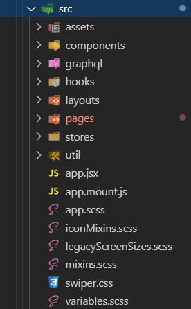

<!-- _paginate: false -->

# WTF is Webpack & Babel

---

## Overview

This lesson will be split in two main sections.

Part one is a high-level historical review of JavaScript and web browsers. We'll also look at Babel & Webpack. By the end we should have a general understanding of the problems they solve and their purpose in web development.

The second will be a demonstration of webpack & babel, writing and compiling code samples to help learning the core concepts.

---

# WhatScript

While JavaScript is typically the name used when mentioning the language, often we're actually talking about **ECMAScript**.

---

# `ECMAScript !== JavaScript`

| Name       | Description                                              |
| ---------- | -------------------------------------------------------- |
| ECMAScript | The committee defined standards and language features    |
| JavaScript | ECMA standard applied to code that runs in a web browser |
| Node.js    | ECMA standard applied to code that runs on a computer    |

---

#

| Name   | Contents                                                                                                                                |
| ------ | --------------------------------------------------------------------------------------------------------------------------------------- |
| ES5    | Core definitions for all ES3 and ES5 functionality                                                                                      |
| ES2015 | Additional APIs available in ES2015 (also known as ES6) - array.find, Promise, Proxy, Symbol, Map, Set, Reflect, etc.                   |
| ES6    | Alias for “ES2015”                                                                                                                      |
| ES2016 | Additional APIs available in ES2016 - array.include, etc.                                                                               |
| ES7    | Alias for “ES2016”                                                                                                                      |
| ES2017 | Additional APIs available in ES2017 - Object.entries, Object.values, Atomics, SharedArrayBuffer, date.formatToParts, typed arrays, etc. |
| ES2018 | Additional APIs available in ES2018 - async iterables, promise.finally, Intl.PluralRules, regexp.groups, etc.                           |
| ES2019 | Additional APIs available in ES2019 - array.flat, array.flatMap, Object.fromEntries, string.trimStart, string.trimEnd, etc.             |
| ES2020 | Additional APIs available in ES2020 - string.matchAll, etc.                                                                             |
| ES2021 | Additional APIs available in ES2021 - promise.any, string.replaceAll etc.                                                               |
| ESNext | Additional APIs available in ESNext - This changes as the JavaScript specification evolves                                              |

---

# Living with Evergreen :evergreen_tree:

With _most_ major Web Browsers have adopted an evergreen release strategy (looking at you, Safari :eyes:), `ESNext` can be a valid and reasonable compile target.

The wait for new ECMA support is weeks.

This is **radically** different than how ECMA and major browsers operated until 2015.

---

# History

## The good parts

---

# A New Hope

### 1995: JavaScript

> First shipped as part of the Netscape Navigator beta in September 1995. Originally called LiveScript the name was changed to JavaScript for the official release in December.

### 1997: ECMAScript

> The name "ECMAScript" was a compromise between the organizations involved in standardizing the language, especially Netscape and Microsoft, whose disputes dominated the early standards sessions

---

# The Empire Strikes Back

### 2003: :skull: RIP ECMA 4

> ECMA 3 released in 1999, and was to be the last major update for 10 years :cry:
>
> On June 30th, the Fourth Edition was abandoned, due to political differences concerning language complexity. Many features proposed for the Fourth Edition have been completely dropped; some were incorporated into the sixth edition.

---

# Return of the Jedi

### 2009: ECMA 5 is released

> Adds "strict mode", getters and setters, library support for JSON, and more complete reflection on object properties.

---

# Webpack

How [`webpack` describes itself](https://webpack.js.org/concepts/):

> At its core, webpack is a static module bundler for modern JavaScript applications. When webpack processes your application, it internally builds a dependency graph from one or more entry points and then combines every module your project needs into one or more bundles, which are static assets to serve your content from.

---

A simplified description:

> Webpack takes **many things** and returns them as **one** or more thing(s).

---

# Babel

How [Babel describes itself](https://babeljs.io/docs/en/):

> ### Babel is a JavaScript compiler
>
> Babel is a toolchain that is mainly used to convert ECMAScript 2015+ code into a backwards compatible version of JavaScript in current and older browsers or environments. Here are the main things Babel can do for you:
>
> - Transform syntax
> - Polyfill features that are missing in your target environment (through a third-party polyfill such as core-js)
> - Source code transformations (codemods)

---

A simplified description:

> Babel takes `*.js` files and converts them from one version of ECMAScript to another.

---

### Operation Simplify

It's often helpful to zoom out and simplify complex situations. When considering a modern web development project, much of the underlying tools that enable how we work are hidden behind abstractions.

---

# Simplifying what Babel & Webpack do

- Webpack is given the file(s) **we** tell it to
- Webpack takes our code and builds a Dependency Graph of every module application needs (`node_modules`, SCSS, YML, SVG, etc.)
- Webpack hands the required files off to Babel to process (transpile, polyfills, etc.)
- Babel returns the updated files to Webpack
- Webpack combines everything into a single `bundle.js`

---

| This :slightly_frowning_face:        | Becomes this :tada:                 |
| ------------------------------------ | ----------------------------------- |
|  |  |

---

# Tools

- [Babel Repl](https://babeljs.io/repl)
- [CanIUse](https://caniuse.com)
  - [Decorators](https://caniuse.com/decorators)
  - [`BigInt`](https://caniuse.com/bigint)
  - [`String.prototype.includes`](https://caniuse.com/es6-string-includes)

### Packages behind the Scenes

- [`core-js`](https://github.com/zloirock/core-js)
- [`browserslist`](https://github.com/browserslist/browserslist)

## 2. Coding Exercise
