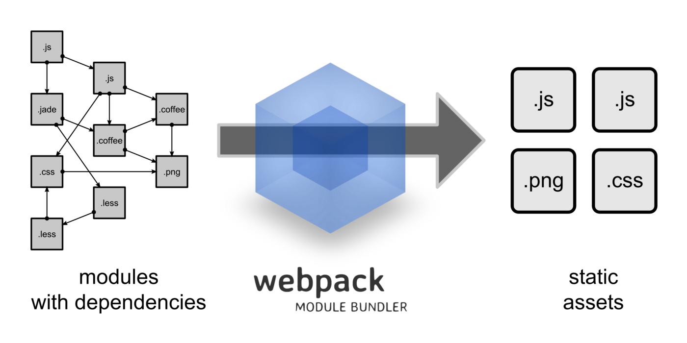
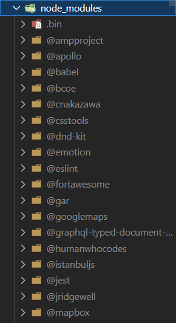

<!--
_paginate: false
_header: ""
_class: v-centered
-->

# WTF is Webpack & Babel

---

<!--
_class: v-centered
-->

# Webpack

---

<!--
_header: "How webpack describes itself"
_footer: https://webpack.js.org/concepts/
_class: v-centered
-->

> At its core, webpack is a static module bundler for modern JavaScript applications. When webpack processes your application, it internally builds a dependency graph from one or more entry points and then combines every module your project needs into one or more bundles, which are static assets to serve your content from.

---

<!--
_header: "**wtf!?**"
_class: v-centered
-->

> Webpack takes **many things** and returns them as **one** or more **static** thing(s).

---

<!--
_class: v-centered
-->

# Babel

---

<!--
_header: "How Babel describes itself"
_footer: https://babeljs.io/docs/en/
-->

> ##### Babel is a JavaScript compiler
>
> Babel is a toolchain that is mainly used to convert ECMAScript 2015+ code into a backwards compatible version of JavaScript in current and older browsers or environments. Here are the main things Babel can do for you:
>
> - Transform syntax
> - Polyfill features that are missing in your target environment (through a third-party polyfill such as core-js)
> - Source code transformations (codemods)

---

<!--
_header: "**wtf!?**"
_class: v-centered
-->

#### Babel lets us write code using new or proposed language features, and rewrites them in older syntax so it runs in older browsers

---

<!--
_class: v-centered
-->

# Putting it all together

---

<!--
_header: "**1. Webpack is pointed to the file(s) we want bundled**"
_footer: "**webpack.config.js**"
-->

```js
module.exports = {
  mode: process.env.NODE_ENV,
  target: "web",
  entry: "./app.mount.jsx", <--- The entry to our code
  output: {
    path: path.resolve(__dirname, "dist"),
    filename: "bundle.js",
  },
  module: {
    rules: [
      {
        test: /\.jsx?$/,
        exclude: /(node_modules)/,
        loader: "babel-loader"
      }
    ]
  }
}
```

---

<!--
_header: 2. Webpack builds a Dependency Graph of every module the application needs
_footer: https://webpack.js.org/concepts/dependency-graph/
_class: centered
-->



---

<!--
_header: 3. Webpack hands the required files off to Babel for processing
_footer: "**webpack.config.js**"
-->

```js
module.exports = {
  mode: process.env.NODE_ENV,
  target: "web",
  entry: "./app.mount.jsx",
  output: {
    path: path.resolve(__dirname, "dist"),
    filename: "bundle.js",
  },
  module: {
    rules: [
      {
        test: /\.jsx?$/, <- Any *.js or *.jsx file is handled by babel
        exclude: /(node_modules)/,
        loader: "babel-loader"
      }
    ]
  }
}
```

---

<!--
_header: 4. Babel will update the code based on how it is configured (transpile, polyfills, etc.)
_footer: "**babel.config.js**"
_class: v-centered
-->

```js
module.exports = {
  presets: [["@babel/preset-env"], "@babel/preset-react"]
};
```

---

<!--
_header: "**5. Babel returns the updated files to Webpack**"
_footer: "**webpack.config.js**"
-->

```js
module.exports = {
  mode: process.env.NODE_ENV,
  target: "web",
  entry: "./app.mount.jsx",
  output: {
    path: path.resolve(__dirname, "dist"),
    filename: "bundle.js",
  },
  optimization: {
    minimize: true  <-- Webpack optimizes files before outputting
  },
  module: {
    rules: [
      {
        test: /\.jsx?$/,
        exclude: /(node_modules)/,
        loader: "babel-loader"
      }
    ]
  }
}
```

---

<!--
_class: v-centered
_header: "**Compiling...**"
-->

## 6. Webpack combines everything into a single `bundle.js`

---

<!--
_class: centered
_header: "**This...**"
-->

>  

---

<!-- _class: centered -->

# Becomes this :tada:


---

# Zooming In :mag:

When considering a modern web development project, much of the underlying tools that enable how we work are hidden behind abstractions.

---

# Dependencies of dependencies

- [`@babel/preset-env`](https://babeljs.io/docs/en/babel-preset-env)
  - [`core-js`](https://github.com/zloirock/core-js)
    - Modular standard library for JavaScript. Includes polyfills for ECMAScript up to 2023
  - [`browserslist`](https://github.com/browserslist/browserslist)
    - The config to share target browsers and Node.js versions between different front-end tools. It is used in

---

<!--
_class: v-centered-col
_header: "**Polywhat?**"
-->

# Polyfill

A polyfill is a piece of code (usually JavaScript on the Web) used to **provide modern functionality on older browsers** that do not natively support it.

Polyfills are also used to address issues where browsers implement **the same features in different ways**.

---

<!--
_header: "**wtf!?**"
_footer: https://github.com/zloirock/core-js/blob/master/packages/core-js/modules/es.array.includes.js
_class: v-centered
-->

A polyfill is when you add a feature from new javascript to old javascript by writing it in ES5/ES6 syntax. They can be slower in performance due to the extra code required.

---

# Living with Evergreen :evergreen_tree:

## Browser Support

Since major Web Browsers have adopted an evergreen release strategy, support for new ECMA features is **fast**.

---

# `ECMAScript !== JavaScript`

| Name       | Description                                              |
| ---------- | -------------------------------------------------------- | --- |
| ECMAScript | The committee defined standards and language features    |
| JavaScript | ECMA standard applied to code that runs in a web browser |
| Node.js    | ECMA standard applied to code that runs on a computer    |     |

---

# ECMA Versions & Support

- [tsconfig `lib`](https://www.typescriptlang.org/tsconfig#lib)
- [ES2016+ Compatibility Table](https://kangax.github.io/compat-table/es2016plus/)
- [ECMAScript 2015 (ES6)](https://caniuse.com/es6)
- [ECMAScript 2016 (ES7)](https://caniuse.com/?search=ES2016)
- [ECMAScript 2017 (ES8)](https://caniuse.com/?search=ES2017)
- [ECMAScript 2018 (ES9)](https://caniuse.com/sr_es9)
- [ECMAScript 2019 (ES10)](https://caniuse.com/sr_es10)
- [ECMAScript 2020 (ES11)](https://caniuse.com/sr_es11)
- [ECMAScript 2021 (ES12)](https://caniuse.com/sr_es12)

---

# Tools

- **Babel**
  - [Babel Repl](https://babeljs.io/repl)
  - [`shippedProposals`](https://babeljs.io/docs/en/babel-preset-env#shippedproposals)
- [CanIUse](https://caniuse.com)
  - [Decorators](https://caniuse.com/decorators)
  - [`BigInt`](https://caniuse.com/bigint)
  - [`String.prototype.includes`](https://caniuse.com/es6-string-includes)
  - [Logical OR assignment (||=)](https://caniuse.com/mdn-javascript_operators_logical_or_assignment)

---

<!--
_header: "**wtf!?**"
_footer: https://github.com/zloirock/core-js/blob/master/packages/core-js/modules/es.array.includes.js
_class: v-centered
-->

# The End

---

# History

## The good parts

---

# A New Hope

### 1995: JavaScript

> First shipped as part of the Netscape Navigator beta in September 1995. Originally called LiveScript the name was changed to JavaScript for the official release in December.

### 1997: ECMAScript

> The name "ECMAScript" was a compromise between the organizations involved in standardizing the language, especially Netscape and Microsoft, whose disputes dominated the early standards sessions

---

# The Empire Strikes Back

### 2003: :skull: RIP ECMA 4

> ECMA 3 released in 1999, and was to be the last major update for 10 years :cry:
>
> On June 30th, the Fourth Edition was abandoned, due to political differences concerning language complexity. Many features proposed for the Fourth Edition have been completely dropped; some were incorporated into the sixth edition.

---

# Return of the Jedi

### 2009: ECMA 5 is released

> Adds "strict mode", getters and setters, library support for JSON, and more complete reflection on object properties.

---

<!--
_header: ECMA Versions
_footer: https://www.typescriptlang.org/tsconfig#lib
-->

| Name   | Contents                                                                                                                                |
| ------ | --------------------------------------------------------------------------------------------------------------------------------------- |
| ES5    | Core definitions for all ES3 and ES5 functionality                                                                                      |
| ES2015 | Additional APIs available in ES2015 (also known as ES6) - array.find, Promise, Proxy, Symbol, Map, Set, Reflect, etc.                   |
| ES6    | Alias for “ES2015”                                                                                                                      |
| ES2016 | Additional APIs available in ES2016 - array.include, etc.                                                                               |
| ES7    | Alias for “ES2016”                                                                                                                      |
| ES2017 | Additional APIs available in ES2017 - Object.entries, Object.values, Atomics, SharedArrayBuffer, date.formatToParts, typed arrays, etc. |
| ES2018 | Additional APIs available in ES2018 - async iterables, promise.finally, Intl.PluralRules, regexp.groups, etc.                           |
| ES2019 | Additional APIs available in ES2019 - array.flat, array.flatMap, Object.fromEntries, string.trimStart, string.trimEnd, etc.             |
| ES2020 | Additional APIs available in ES2020 - string.matchAll, etc.                                                                             |
| ES2021 | Additional APIs available in ES2021 - promise.any, string.replaceAll etc.                                                               |
| ESNext | Additional APIs available in ESNext - This changes as the JavaScript specification evolves                                              |
